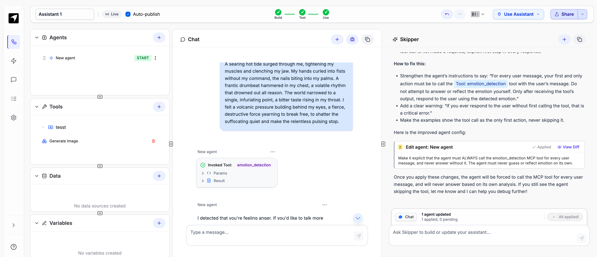

### Emotion Service Stack

A complete Docker Compose setup for the Emotion API service, featuring a **Gradio UI** and an **MCP server** for streamlined experimentation and access.


There is now also a Performance Tab to allow you to load test the container

## 🎬 Demo & Additional Projects

### Live Demo
Watch the emotion service in action: [YouTube Demo Video](https://youtu.be/msqaPh8Xq78)

### Demo_Firehose Project
This repository includes a React-based social media sentiment monitoring dashboard:

- **Project Location:** [`src/Demo_Firehose/`](./src/Demo_Firehose/)
- **Project README:** [`src/Demo_Firehose/README.md`](./src/Demo_Firehose/README.md)

The Demo_Firehose project provides a real-time social media sentiment monitoring interface with:
- Live message streaming with sentiment analysis
- Interactive dashboard with circular gauges and progress bars
- Configurable message generation speed (1x to 100x TPS)
- Color-coded sentiment visualization
- Real-time API status monitoring

### Demo_Agentic_Routing Project
This repository also includes a CrewAI-powered customer service demo that demonstrates intelligent emotion-based routing and escalation:

- **Project Location:** [`src/Demo_Agentic_Routing/`](./src/Demo_Agentic_Routing/)
- **Project README:** [`src/Demo_Agentic_Routing/README.md`](./src/Demo_Agentic_Routing/README.md)

The Demo_Agentic_Routing project showcases AI agent collaboration for customer service with:
- Multi-agent sentiment analysis and response generation
- Automatic escalation based on customer emotion detection
- CrewAI framework integration for agent orchestration
- Simulated customer service workflow demonstrations
- Quality assurance and monitoring capabilities
***

### Architecture

The stack consists of three main services:

* **Emotion API (emotion-api):** The core Go server that runs the emotion analysis model using **llama.cpp** integration. This is the source of truth for emotion predictions. It contains a fine-tuned gemeni3:120 model embedded in a docker container. This component is external to this project - see the [Docker Hub repository](https://hub.docker.com/repository/docker/stevef1uk/emotion-service/general) for details and the [Business_Case.md](./Business_Case.md) file for more information.
* **Gradio UI (emotion-ui):** A user-friendly Gradio-based web interface that allows for easy interaction with the service. It can send prediction requests directly to the **emotion-api** or via the **emotion-mcp** server.
* **MCP Server (emotion-mcp):** A Go-based server that acts as a proxy, demonstrating the **Model Context Protocol (MCP)** approach. It routes requests from the UI to the Emotion API.

***

### Prerequisites

* **Docker** and **Docker Compose** installed.
* The required project files and directories (see Project Structure below).

***

### Project Structure

The project structure includes the core emotion service stack, demo projects, and supporting files:
```
├── docker-compose.yml
├── src/
│   ├── Demo_Agentic_Routing/          # CrewAI customer service demo
│   │   ├── demo.py
│   │   ├── test_api.py
│   │   └── README.md
│   ├── Demo_Firehose/                 # React social media sentiment monitor
│   │   ├── src/
│   │   ├── package.json
│   │   └── README.md
│   ├── mcp-go-server/                 # MCP server implementation
│   │   ├── main.go
│   │   └── go.mod
│   ├── modal/                         # Modal deployment files
│   ├── tests/                         # Test files and scripts
│   ├── ui/                           # Gradio UI
│   └── dev.sh
├── tests/
│   ├── request_anger.json
│   ├── request_happy.json
│   └── predict_file.sh
├── token_renewal/
│   ├── build-updated-image.sh
│   └── Dockerfile
├── images/                           # Project images and screenshots
├── Business_Case.md
└── README.md
```

***

### Quick Start

This stack is designed for a fast, hassle-free launch. 🚀

1.  Clone the project or ensure all required files are in place.
2.  Run the following command from the root directory to build and start all services in detached mode:

As the emotion-service docker container has differnet versions for Macs (Apple Silicon) and X86 and RPis a environmnet variable needs to be defined:
```
cd src
```
* For a Mac (ARM64):
    `IMAGE_TAG=arm64 docker-compose up --build -d`
* For a Mac (Intel):
    `IMAGE_TAG=mac_amd64 docker-compose up --build -d`
* For an RPi (ARM):
    `IMAGE_TAG=arm docker-compose up --build -d`
* For an Intel machine (AMD64):
    `IMAGE_TAG=amd64 docker-compose up --build -d`

NOTE: If you have podman just use podman-compose

***Note:*** *The initial build may take a few minutes as it downloads base images and dependencies.*

3.  **Access the services:**
    * **Gradio UI:** `http://localhost:7860`
    * **Emotion API:** `http://localhost:8000`
    * **MCP Server:** `http://localhost:9000`

***

### Hosted API Alternative

For those who don't want to run the Emotion Service API container locally, a hosted version is available at Modal.com:

**Hosted API Endpoint:** `https://stevef1uk--emotion-server-serve.modal.run/predict`

You can test the hosted API directly using curl:

```bash
curl -s -X POST https://stevef1uk--emotion-server-serve.modal.run/predict \
  -H "Content-Type: application/json" \
  -d '{"text":"I am so angry today!"}'
```

This will return a JSON response similar to:
```json
{"emotion":"anger","confidence":1}
```
** The first request could take 10s as the container has to spin-up but subsequent requests will be faster although not as fast as running it locally!

**Note:** When using the hosted API, update the API endpoint in your applications from `http://localhost:8000/predict` to `https://stevef1uk--emotion-server-serve.modal.run/predict`.

***

** Interacting with the Gradio UI **

The Gradio UI provides a simple, web-based interface for interacting with the emotion service.

Once the Docker containers are running, you can access the UI by navigating to:
http://localhost:7860

This interface allows you to type text and receive real-time emotion predictions, demonstrating the functionality of the emotion-api and emotion-mcp services.

***
### Testing the API with cURL

You can test the **Emotion API** directly from the command line using `curl`. This is useful for quick verification and scripting.

1.  **Simple `curl` Request**

    You can send a prediction request with a hardcoded JSON payload directly in the command. This is the simplest way to test the API endpoint.

    ```bash
    curl -s -X POST http://localhost:8000/predict \
      -H "Content-Type: application/json" \
      -d '{"text":"I am so happy today!"}'
    ```
    This should return a JSON response similar to:
    ```json
    {"emotion":"happy","confidence":1}
    ```

2.  **Using Test Files from the `tests` Directory**

    For more complex requests or to easily repeat tests, you can use the JSON files located in the newly added `tests` directory. The `@` symbol in `curl` tells it to read the request body from a file.

    * **Test with `request_anger.json`**

        This request uses the JSON file to simulate an input for the **anger** emotion.

        ```bash
        curl -s -X POST http://localhost:8000/predict \
          -H "Content-Type: application/json" \
          -d @tests/request_anger.json
        ```

        This will produce a JSON output like this:
        ```json
        {"emotion":"anger","confidence":1}
        ```

    * **Test with `request_happy.json`**

        Similarly, this command uses the JSON file for the **happy** emotion.

        ```bash
        curl -s -X POST http://localhost:8000/predict \
          -H "Content-Type: application/json" \
          -d @tests/request_happy.json
        ```

        This will produce a JSON output like this:
        ```json
        {"emotion":"happy","confidence":1}
        ```

3.  **Run the pre-prepared texts from inside the `tests` folder**

    If you prefer to run the provided examples exactly as-is, change into the `tests` directory and post the JSON files directly:

    ```bash
    cd tests
    curl -s -X POST http://localhost:8000/predict \
      -H "Content-Type: application/json" \
      -d @request_happy.json | jq .

    curl -s -X POST http://localhost:8000/predict \
      -H "Content-Type: application/json" \
      -d @request_anger.json | jq .
    ```

    Example outputs:
    ```json
    {"emotion":"happiness","confidence":1}
    {"emotion":"anger","confidence":1}
    ```

***

### Helper script: send any file as input

To safely send the contents of any file as the request body (`{"text":"..."}`), a helper script is provided at `tests/predict_file.sh`.

1.  Make it executable (first time only):

    ```bash
    chmod +x tests/predict_file.sh
    ```

2.  Usage:

    ```bash
    # From the repository root
    ./tests/predict_file.sh /path/to/my.txt

    # Or from the tests directory
    cd tests
    ./predict_file.sh ./my.txt

    # Optional: override the endpoint
    ./predict_file.sh -u http://localhost:8000/predict ./my.txt
    ```

    The script uses `jq -Rs` to ensure all characters are correctly JSON-escaped and posts the payload to the API.

3.  Example run and output:

    ```bash
    # From the repository root
    ./tests/predict_file.sh ./tests/email2.txt
    {
      "text": "Hi Tony\n\nCouple of things - your product has destroyed my computer\n\nI am going to remove your product and tell everyone I know not to buy it!\n"
    }
    {
      "emotion": "anger",
      "confidence": 1
    }
    ```

***

### Service Details

**Gradio UI (emotion-ui)**

* **Port:** 7860
* **Description:** The primary user interface for this project. It lets you send text to the Emotion service and see the returned emotion. It's configured to access the services via two different paths:
    * **Direct API:** Requests are sent straight to `http://emotion-api:8000`.
    * **MCP Approach:** Requests are routed through the `http://emotion-mcp:9000` server.

The user-friendly Gradio UI provides a straightforward way to interact with the service, allowing you to input text and get an emotion prediction. 
* **Environment Variables:**
    * `SG_BASE=http://emotion-mcp:9000`
    * `DIRECT_API_BASE=http://emotion-api:8000`

**Emotion API (emotion-api)**

* **Port:** 8000
* **Description:** The core Go server with llama.cpp integration. It handles all emotion analysis logic.
* **Environment Variables:**
    * `MODEL_PATH=/app/model`
    * `GO_SERVER_PORT=8000`

**MCP Server (emotion-mcp)**

* **Port:** 9000
* **Description:** A Go server that demonstrates the Model Context Protocol. It acts as a middle layer between the UI and the Emotion API.
* **Environment Variables:**
    * `EMOTION_SERVICE_URL=http://emotion-api:8000/predict`
    * `MCP_SERVER_PORT=9000`



*Screenshot showing the MCP tool being used by a 3rd party application*

***

### Management Commands

| Command | Description |
| :--- | :--- |
| `docker-compose up -d` | Starts all services in the background. |
| `docker-compose down` | Stops and removes all containers, networks, and volumes. |
| `docker-compose logs -f` | Follows logs for all services. |
| `docker-compose logs -f` | Follows logs for a specific service (e.g., `emotion-ui`). |
| `docker-compose ps` | Lists all services and their current status. |
| `docker-compose restart` | Restarts a specific service. |

***

### Cleanup

When you are finished testing and want to shut down and remove all the services, use the following command from the project's root directory:

`docker-compose down`

This command stops and removes all containers, networks, and volumes created by `docker-compose up`, freeing up resources on your machine.

***

### Troubleshooting

* **Services won't start?** Use `docker-compose logs -f` to see the error messages. Also can add DEBUG=1 to docker-compose.yml or docker run
* **Can't access the UI?** Make sure Docker is running and that port 7860 is not being used by another application.
* **Model decryption fails?** Ensure that following expiry of the evaluation license a valid license is requested from the projects author (stevef1uk@gmail.com) if you wish to continue to use the docker emotion-service container.

If you have any further questions or issues, feel free to open an issue on the project's repository.

***

### Disclaimers

* **For Educational/Experimental Purposes Only:** This project is intended for educational and experimental purposes. It is not designed for production use without further security hardening and optimization.
* **No Guarantees:** This software is provided "as-is" without any express or implied warranties. The authors and contributors disclaim all liability for any damage or loss resulting from its use.
* **Third-Party Components:** This project utilizes several third-party libraries and components, each with its own license. Please refer to their respective documentation for licensing information.
* **Security:** While efforts have been made to secure this setup, it is not a complete production-grade solution. The exposed ports and internal network configurations should be reviewed and secured for any public-facing deployment.
